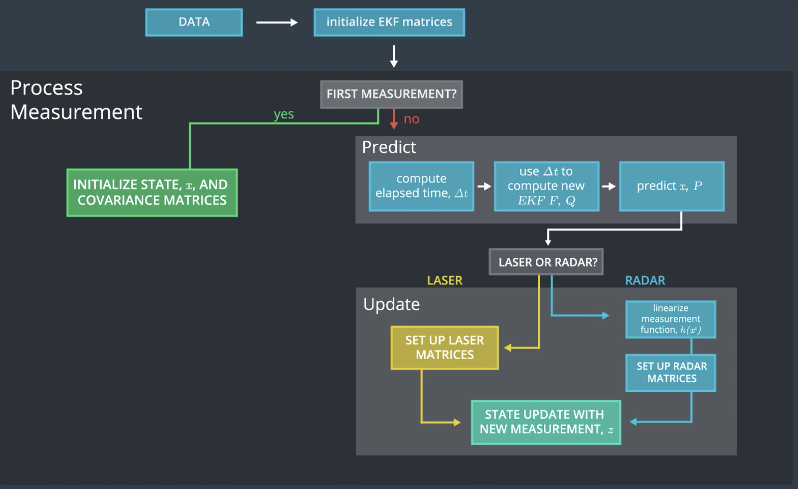
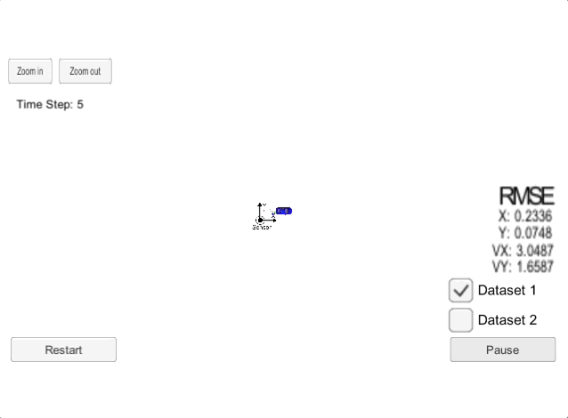

# Extended Kalman Filter Project

The goal of this project is to use an Extended Kalman Filter (EKF) with noisy LiDAR and RADAR measurements to estimate the state of a moving object of interest. 

# Project Success Criteria

The video below shows what the simulator looks like when my C++ program is using its Kalman filter to track the object.


Notes:
* Lidar measurements are red circles
* Radar measurements are blue circles with an arrow pointing in the direction of the observed angle,
* Estimation markers are green triangles

The simulator provides the program with the measurement data (either lidar or radar), and the program feeds back the measured estimation marker and RMSE values from its Kalman filter.


## About the Data file

The file [obj_pose-laser-radar-synthetic-input.txt](data/obj_pose-laser-radar-synthetic-input.txt) contains the RADAR and LiDAR data. Here is a sample extract:

```text
...
R	2.990916e+00	2.176679e-01	5.191807e+00	1477010443450000	2.939043e+00	6.127858e-01	5.193090e+00	8.066803e-02	1.553247e-02	6.893328e-02
L	3.012223e+00	6.370455e-01	1477010443500000	3.198690e+00	6.172666e-01	5.191470e+00	9.854147e-02	1.897914e-02	7.578466e-02
R	3.593878e+00	1.354522e-01	5.161753e+00	1477010443550000	3.458253e+00	6.226855e-01	5.189627e+00	1.181798e-01	2.276837e-02	8.262407e-02
L	3.893650e+00	3.117930e-01	1477010443600000	3.717722e+00	6.291305e-01	5.187542e+00	1.395764e-01	2.689958e-02	8.945044e-02
R	4.255547e+00	1.648397e-01	5.433327e+00	1477010443650000	3.977082e+00	6.366893e-01	5.185194e+00	1.627238e-01	3.137210e-02	9.626268e-02
L	4.309346e+00	5.785637e-01	1477010443700000	4.236322e+00	6.454494e-01	5.182560e+00	1.876140e-01	3.618523e-02	1.030597e-01
...
```

Each row represents a sensor measurement where the first column tells you if the measurement comes from radar (`R`) or lidar (`L`).

For a row containing radar data, the columns are: `sensor_type`, `rho_measured`, `phi_measured`, `rhodot_measured`, `timestamp`, `x_groundtruth`, `y_groundtruth`, `vx_groundtruth`, `vy_groundtruth`, `yaw_groundtruth`, `yawrate_groundtruth`.

For a row containing lidar data, the columns are: `sensor_type`, `x_measured`, `y_measured`, `timestamp`, `x_groundtruth`, `y_groundtruth`, `vx_groundtruth`, `vy_groundtruth`, `yaw_groundtruth`, `yawrate_groundtruth`.

Whereas radar has three measurements (`rho`, `phi`, `rhodot`), lidar has two measurements (`x`, `y`).

My program uses the measurement values and timestamp in my Kalman filter algorithm. `Groundtruth`, which represents the actual path the bicycle took, is for calculating root mean squared error.

We do not need to worry about yaw and yaw rate ground truth values for this project.


## Code Compilation

Basically, the simulator acts as a client, and the C++ program I develop acts as a server. They communicate using `uWebSocketIO`. 

The main project source files are in the [src](src) folder.

* [main.cpp](src/main.cpp): communicates with the Simulator receiving data measurements, calls a function to run the Kalman filter, calls a function to calculate RMSE
* [FusionEKF.cpp](src/FusionEKF.cpp): initializes the filter, calls the `predict()` function, calls the `update()` function
* [kalman_filter.cpp](src/kalman_filter.cpp): defines the `predict()` function, the `update()` function for LiDAR, and the `update()` function for RADAR
* [tools.cpp](src/tools.cpp): contains functions to calculate RMSE and the Jacobian matrix


## Accuracy

The values for `px`, `py`, `vx`, and `vy` RMSE should be less than or equal to these values: 
> `[.11, .11, 0.52, 0.52]`.

I verified over multiple runs of the simulator that my RMSE values were less than the specified threshold values. These are the values I got:

`px` | `py` | `vx` | `vy`
---:| ---:| ---:| ---:
0.0973|0.0855|0.4513|0.4399


## Algorithm Correctness

The three main steps for programming a Kalman filter, which my EFK follows, are:

1. **initializing** the Kalman filter variables
2. **predicting** where our object is going to be after a time step Δt
3. **updating** where our object is based on sensor measurements

Then the prediction and update steps repeat in a loop.

To measure how well our Kalman filter performs, we then calculate root mean squared error comparing the Kalman filter results with the provided ground truth.

These three steps (initialize, predict, update) plus calculating RMSE encapsulate the entire extended Kalman filter project.

### Sensor fusion processing flow
My implementation follows this general sensor fusion flow:



Here is a brief overview of what happens when we run the simulator and program are running:

* [main.cpp](src/main.cpp) reads in the data and sends a sensor measurement to [FusionEKF.cpp](src/FusionEKF.cpp).
* [FusionEKF.cpp](src/FusionEKF.cpp) takes the sensor data and initializes variables and updates variables. The Kalman filter equations are not in this file. FusionEKF.cpp has a variable called `ekf_`, which is an instance of a `KalmanFilter` class. The `ekf_` will hold the matrix and vector values. The program also uses the `ekf_` instance to call the `predict()` and `update()` functions.
* The `KalmanFilter` class is defined in [kalman_filter.cpp](src/kalman_filter.cpp) and [kalman_filter.h](src/kalman_filter.h). The `KalmanFilter` class contains functions for the prediction and update steps.

This animated GIF provides a zoomed-out view:



### Kalman filter handles first measurements appropriately

The `ProcessMeasurement()` function in [FusionEKF.cpp](src/FusionEKF.cpp) implements the code to handle the first measurement:

```c++
void FusionEKF::ProcessMeasurement(const MeasurementPackage & measurement_pack)
{
    if(!is_initialized_)
    {
        // first measurement
        ekf_.x_ = VectorXd(4);
        ekf_.x_ << 1, 1, 1, 1;

        ...
```

### Kalman filter predicts then updates

[FusionEKF.cpp](src/FusionEKF.cpp) initializes the filter, calls the `predict()` function, calls the `update()` function

### Kalman filter handles RADAR and LiDAR measurements

The `MeasurementPackage` class in [](src/measurement_package.h) contains an `enum` called `SensorType` that specifies two sensor types, `LASER`, and `RADAR`. 

```c++
class MeasurementPackage {
 public:
  enum SensorType{
    LASER,
    RADAR
  } sensor_type_;

  long long timestamp_;

  Eigen::VectorXd raw_measurements_;
};
```

The `ProcessMeasurement()` function in [FusionEKF.cpp](src/FusionEKF.cpp) handles both RADAR and LiDAR measurements:

```c++
        if(measurement_pack.sensor_type_ == MeasurementPackage::RADAR)
        {
            double rho = measurement_pack.raw_measurements_(0);
            double phi = measurement_pack.raw_measurements_(1);
            double rhodot = measurement_pack.raw_measurements_(2);

            // polar to cartesian - r * cos(angle) for x and r * sin(angle) for y
            ekf_.x_ << rho * cos(phi), rho * sin(phi), rhodot * cos(phi), rhodot * sin(phi);
        }
        else if(measurement_pack.sensor_type_ == MeasurementPackage::LASER)
        {
            // Initialize state.
            ekf_.x_ << measurement_pack.raw_measurements_(0), measurement_pack.raw_measurements_(1), 0.0, 0.0;
        }

```

## Code Efficiency
My EFK algorithm avoids unnecessary calculations. I attempt to strike a balance between comprehension, stability, robustness, security, and speed.

# Building and running the project

## Code Style

This project employs [Google's C++ style guide](https://google.github.io/styleguide/cppguide.html).

## Important Dependencies

* cmake >= 3.5
    * All OSes: [click here for installation instructions](https://cmake.org/install/)
* make >= 4.1 (Linux, Mac), 3.81 (Windows)
    * Linux: make is installed by default on most Linux distros
    * Mac: [install Xcode command line tools to get make](https://developer.apple.com/xcode/features/)
    * Windows: [Click here for installation instructions](http://gnuwin32.sourceforge.net/packages/make.htm)
* gcc/g++ >= 5.4
    * Linux: gcc / g++ is installed by default on most Linux distros
    * Mac: same deal as make - [install Xcode command line tools](https://developer.apple.com/xcode/features/)
    * Windows: recommend using [MinGW](http://www.mingw.org/)
* uWebSockets 
    * Set up and install [uWebSocketIO](https://github.com/uWebSockets/uWebSockets)
    * Note: the branch `e94b6e1` is the version of `uWebSocketIO` that works with the Udacity simulator

## Basic Build Instructions

1. Clone this repo.
2. Make a build directory: `mkdir build && cd build`
3. Compile: `cmake .. && make`
    * On windows, you may need to run: `cmake .. -G "Unix Makefiles" && make`
4. Run it: `./ExtendedKF`
