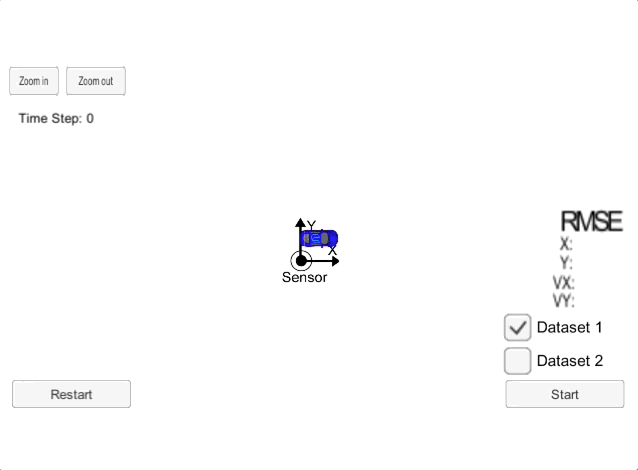
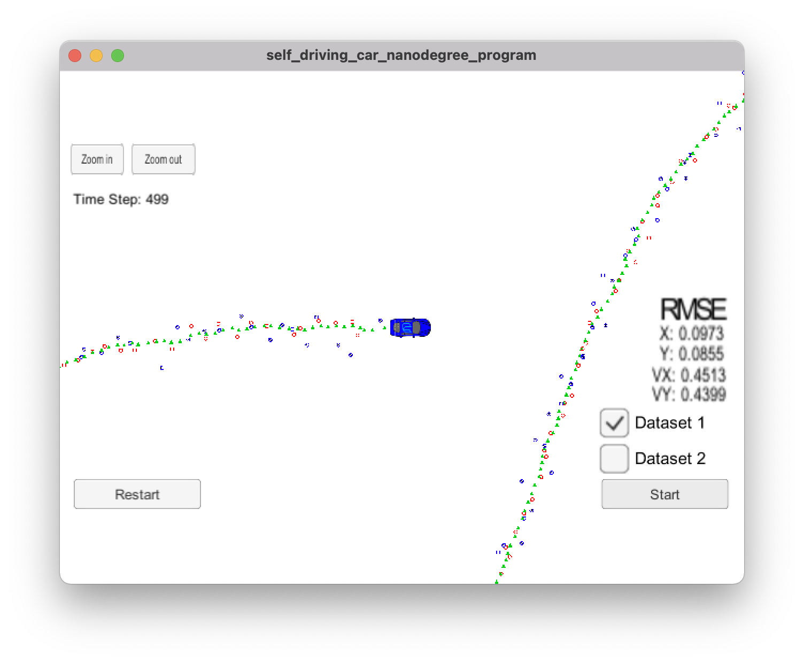

# Extended Kalman Filter Project

The goal of this project is to use an Extended Kalman Filter (EKF) with noisy LiDAR and RADAR measurements to estimate the state of a moving object of interest. 

# Project Success Criteria

The video below shows what the simulator looks like when my C++ program is using its Kalman filter to track the object.

Notes:
* Lidar measurements are red circles
* Radar measurements are blue circles with an arrow pointing in the direction of the observed angle,
* Estimation markers are green triangles

The simulator provides the program with the measurement data (either lidar or radar), and the program feeds back the measured estimation marker and RMSE values from its Kalman filter.

## Code Compilation

## Accuracy

The values for `px`, `py`, `vx`, and `vy` RMSE should be less than or equal to these values: `[.11, .11, 0.52, 0.52]`.

I verified over multiple runs of the simulator that my RMSE values were less than the specified threshold values. These are the values I got:

`px` | `py` | `vx` | `vy`
---:| ---:| ---:| ---:
0.0973|0.0855|0.4513|0.4399

## Algorithm Correctness

### Sensor fusion processing flow

### Kalman filter handles first measurements appropriately

### Kalman filter predicts then updates

### Kalman filter handles RADAR and LiDAR measurements

## Code Efficiency

# Building and running the project

## Code Style

This project employs [Google's C++ style guide](https://google.github.io/styleguide/cppguide.html).

## Important Dependencies

* cmake >= 3.5
    * All OSes: [click here for installation instructions](https://cmake.org/install/)
* make >= 4.1 (Linux, Mac), 3.81 (Windows)
    * Linux: make is installed by default on most Linux distros
    * Mac: [install Xcode command line tools to get make](https://developer.apple.com/xcode/features/)
    * Windows: [Click here for installation instructions](http://gnuwin32.sourceforge.net/packages/make.htm)
* gcc/g++ >= 5.4
    * Linux: gcc / g++ is installed by default on most Linux distros
    * Mac: same deal as make - [install Xcode command line tools](https://developer.apple.com/xcode/features/)
    * Windows: recommend using [MinGW](http://www.mingw.org/)
* uWebSockets 
    * Set up and install [uWebSocketIO](https://github.com/uWebSockets/uWebSockets)
    * Note: the branch `e94b6e1` is the version of `uWebSocketIO` that works with the Udacity simulator

## Basic Build Instructions

1. Clone this repo.
2. Make a build directory: `mkdir build && cd build`
3. Compile: `cmake .. && make`
    * On windows, you may need to run: `cmake .. -G "Unix Makefiles" && make`
4. Run it: `./ExtendedKF`

